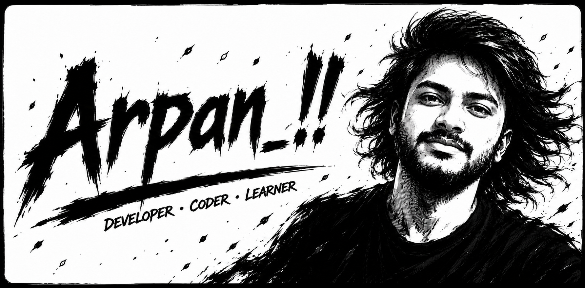

  

---

## ✦ Know About Me ✦

### Hey there! I'm Arpan 👋

I'm a **Developer · Coder · Learner** who builds things that (sometimes) work on the first try.
By day, I pretend to understand clean code. By night, I write scripts to automate the things I was supposed to do manually.
When I'm not debugging, I'm probably making the same mistake in a different language.

> *"Code is never finished. It only becomes slightly less broken over time."*

---

## ✦ Tech Stack ✦

---

## ✦ Top Projects *(built to avoid manual labor)* ✦

| Project | What it does |
|--------|--------------|
| 🔥 **[Project One](https://github.com/Arpan)** | Because doing it manually is for people with free time. |
| ⚡ **[Project Two](https://github.com/Arpan)** | Automates the thing I kept forgetting to do. |
| 🧠 **[Project Three](https://github.com/Arpan)** | AI-powered. Sounds smarter than it is. |

> 💡 *Replace the project names, links, and descriptions above with your actual projects!*

---

## ✦ GitHub Stats ✦

  
  

  

---

## ✦ Connect ✦

---

*Every commit I make is essentially just a small, desperate apology to my future self.*
*Someday I will return to this codebase, look at the spaghetti I've written, and wonder who let me anywhere near a keyboard.*

